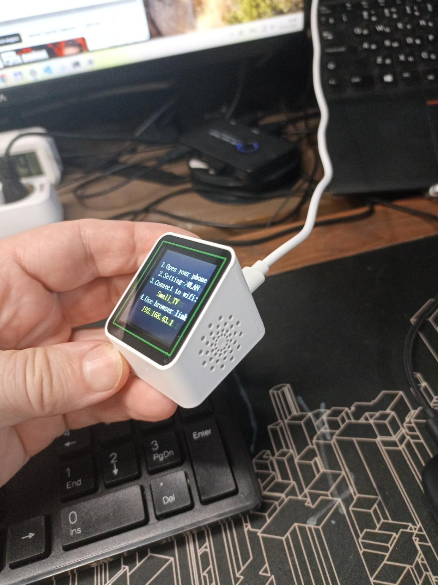
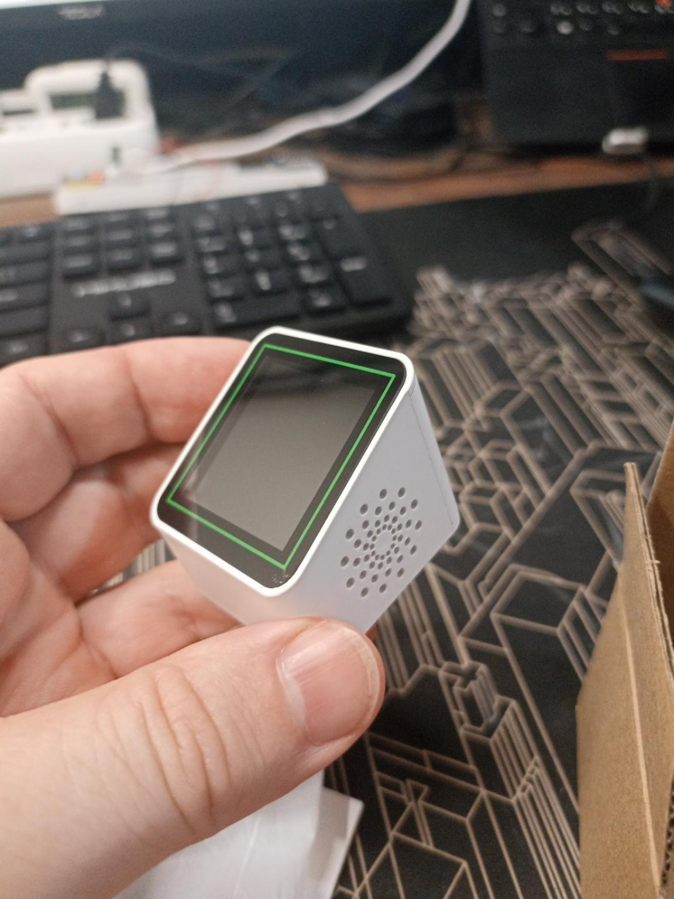
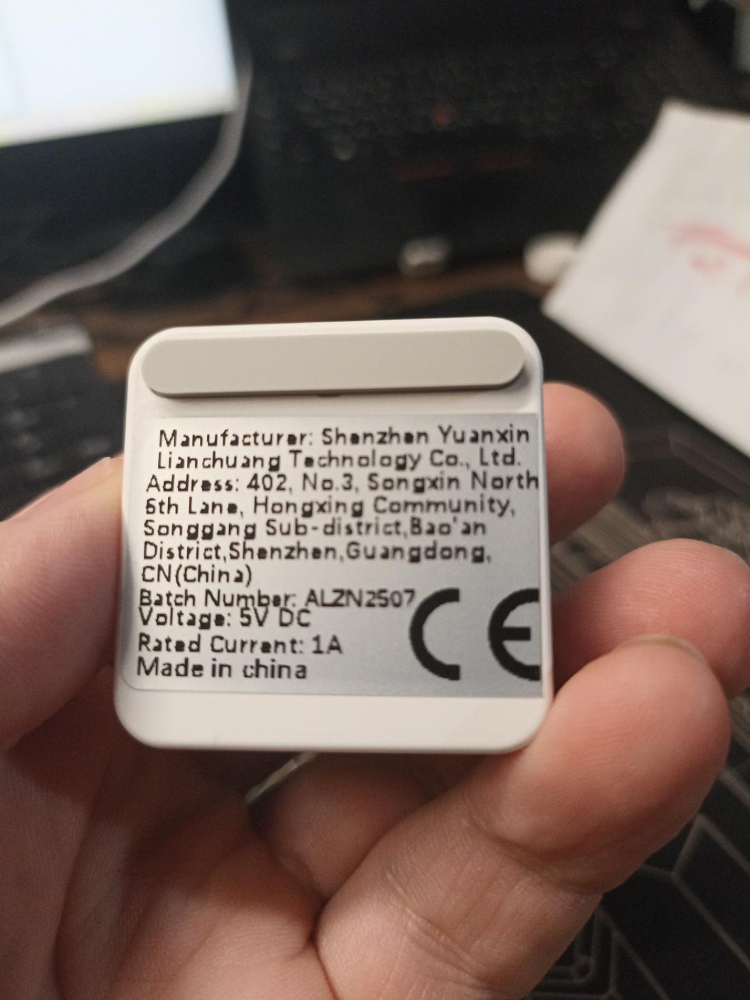
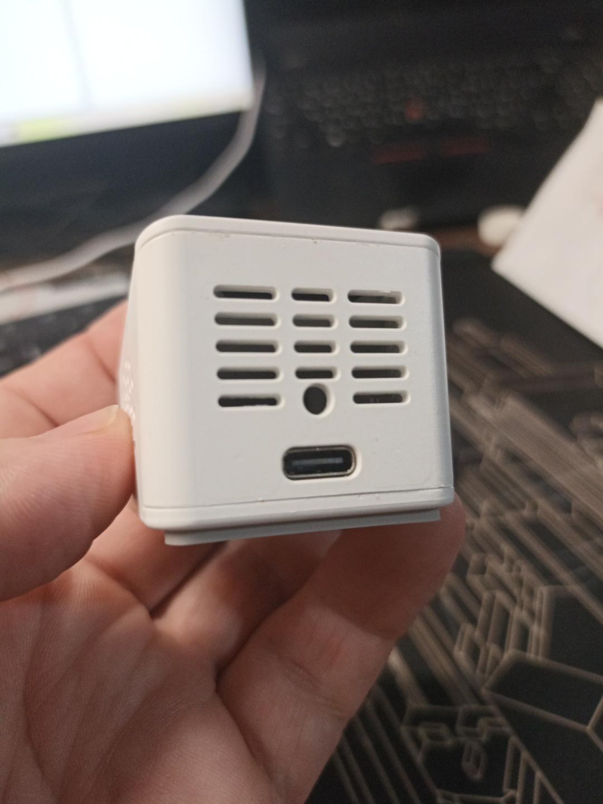

# Small TV ESP32-C2 smart clock

This directory documents the connected Small_TV desktop Wi-Fi clock and
preserves its original flash contents. The device has a white wedge-shaped
plastic enclosure, an inclined colour display with a green border, circular
perforations on one side, and a USB-C connector on the other.



## Device identification

The following details are visible in the owner's photographs supplied on
2026-10-10 in `smart_clock_chat_with_photos.zip`:

| Item | Observed on this device |
| --- | --- |
| Manufacturer | Shenzhen Yuanxin Lianchuang Technology Co., Ltd. |
| Batch number | `ALZN2507` |
| Labelled supply | 5 V DC, rated current 1 A |
| Connector | USB-C; serial data access was confirmed during the flash backup |
| Setup Wi-Fi network | `Small_TV` |
| Setup address | `http://192.168.43.1` |
| Enclosure | White plastic, inclined display, green display border and side perforations |

The 1 A value is the label rating, not a measured operating current. The
powered-on photograph shows instructions to connect a phone to `Small_TV`
and open the setup address in a browser; the setup page itself was not
tested during the backup.

The supplied conversation associates this enclosure with the Smart Clock
STV08. The photographed label does not show a model number or FCC ID, so
STV08 remains a reference identification rather than a confirmed model
code for this particular unit. Its dimensions have not been measured.

## Photographs

The four photographs below have all JPEG application metadata, comments
and trailing data removed, including any EXIF/GPS, XMP/IPTC, embedded
thumbnails and colour-profile metadata. The JPEG image data was kept
without recompression; decoded pixels and dimensions were verified
unchanged. The supplied copies had no EXIF/GPS tags; their JFIF and sRGB
ICC blocks were removed. Only the sanitized copies are included here.

| File | View |
| --- | --- |
| [01-front.jpg](images/01-front.jpg) | Display, green border and circular side perforations |
| [02-back-label.jpg](images/02-back-label.jpg) | Manufacturer, batch, supply rating and rubber strip |
| [03-usb-c-side.jpg](images/03-usb-c-side.jpg) | USB-C connector, slots and enclosure seams |
| [04-powered-on.jpg](images/04-powered-on.jpg) | Powered device and factory Wi-Fi setup instructions |





## Identified hardware

- Controller: ESP32-C2 / ESP8684H, silicon revision v2.0.
- CPU: single-core RISC-V, maximum frequency 120 MHz.
- Flash: 4 MiB (4,194,304 bytes), embedded; manufacturer ID `0xc8`,
  device ID `0x4016`. esptool identifies the flash vendor as GD.
- Crystal: 26 MHz.
- MAC address: `58:2a:bd:28:7d:54`.
- USB adapter: CH340, VID `1a86`, PID `7523`; capture port: COM8.
- On-chip SRAM: 272 KiB, including 16 KiB used for cache, according to the
  [Espressif ESP8684 datasheet](https://documentation.espressif.com/esp8684_datasheet_en.html).
  Free runtime RAM was not measured.

The ESP32-C2 supports 2.4 GHz Wi-Fi and Bluetooth LE. It has no additional
programmable ULP/LP core, no I2S peripheral and no built-in audio DAC. See
the [ESP8684 datasheet](https://documentation.espressif.com/esp8684_datasheet_en.html)
and the [ESP-IDF ULP support note](https://docs.espressif.com/projects/esp-idf/en/stable/esp32c2/api-reference/system/ulp.html).
An audio output for a YoRadio port would therefore need its own design;
no radio firmware or audio output has been tested on this unit.

## Display and board references

A [first-hand ESP32-C2 weather-clock teardown by J0k3r2k1](https://community.home-assistant.io/t/installing-esphome-on-new-smart-weather-clock-wifi-weather-station-display/1006172)
reports an ST7789V SPI display, 240 x 240 pixels, 4 MB flash and a 26 MHz
crystal. The memory and crystal match our serial diagnostics. The
[smalltv-mod ESP32-C2 hardware page](https://giovi321.github.io/smalltv-mod/getting-started/hardware/#smalltv-esp32-c2--esp8684)
also describes a 1.54-inch panel, a CH340C USB-UART bridge and an
AMS1117-3.3 regulator.

The following display connections are reported by both projects. They
are a starting point for investigation, not a verified pinout of our
unopened device:

| Display signal | Reported connection |
| --- | --- |
| SPI clock / SCK | GPIO4 |
| SPI data / MOSI | GPIO6 |
| Data / command | GPIO5 |
| Reset | GPIO1 |
| Chip select | Ground, permanently selected |
| Backlight | GPIO18, active-low |

Both references use SPI mode 3. Their RGB/BGR colour settings differ, so
colour order, inversion and orientation need verification on our panel.
The display controller, diagonal, GPIO wiring, exact CH340 package and
regulator marking have not been checked on this device's PCB.

J0k3r2k1's teardown describes two screws hidden under a rubber strip,
after which the board and display slide out together. Our photograph
shows a similar strip, but the fasteners and opening method have not
been confirmed here. The side perforations alone do not establish that
there is a speaker; speaker, amplifier, battery and microphone presence
remain unverified.

The [teardown author's repository](https://github.com/J0k3r2k1/Smart-weather-clock)
contains another unit's stock backup. Our own verified dump below is the
restoration reference for this device. Similar-looking SmallTV products
also use ESP8266 or classic ESP32 boards, so their firmware and pinouts
do not establish compatibility with this ESP32-C2 unit.

## Original firmware backup

Complete flash snapshot read from the connected device on 2026-10-10 at
16:42:40 UTC (18:42:40 Europe/Budapest).

### Files and verification

- `full-flash.bin`: all flash bytes from address `0x000000` through `0x3fffff`,
  including firmware, partition data and any saved device settings.
- `full-flash.bin.sha256`: SHA-256 checksum of the complete binary.
- `manifest.json`: capture details and verification result.

SHA-256:

```text
5321a6b9016a8fc8335958193b4ab182e0d9ea85cfc3363063f120080c1844f4
```

esptool 5.2.0 read the snapshot at 460800 baud. A subsequent `verify-flash`
operation against the connected device succeeded with a matching digest.
The archived copy was also checked against the original size and SHA-256.
No flash was written or erased. An application reset was issued after the
capture; application startup was not independently verified.

The binary is stored with Git LFS. Run `git lfs pull` after cloning to obtain
the complete backup file.

## Evidence provenance

Device appearance and label details above come from the owner's four
photographs. Controller, revision, flash, crystal and USB adapter details
come from the serial diagnostics recorded in `manifest.json`. Display and
teardown details are attributed to the external projects and remain
unverified on this unit. The conversation in the supplied ZIP was used
as a list of leads, not as independently verified hardware documentation.
