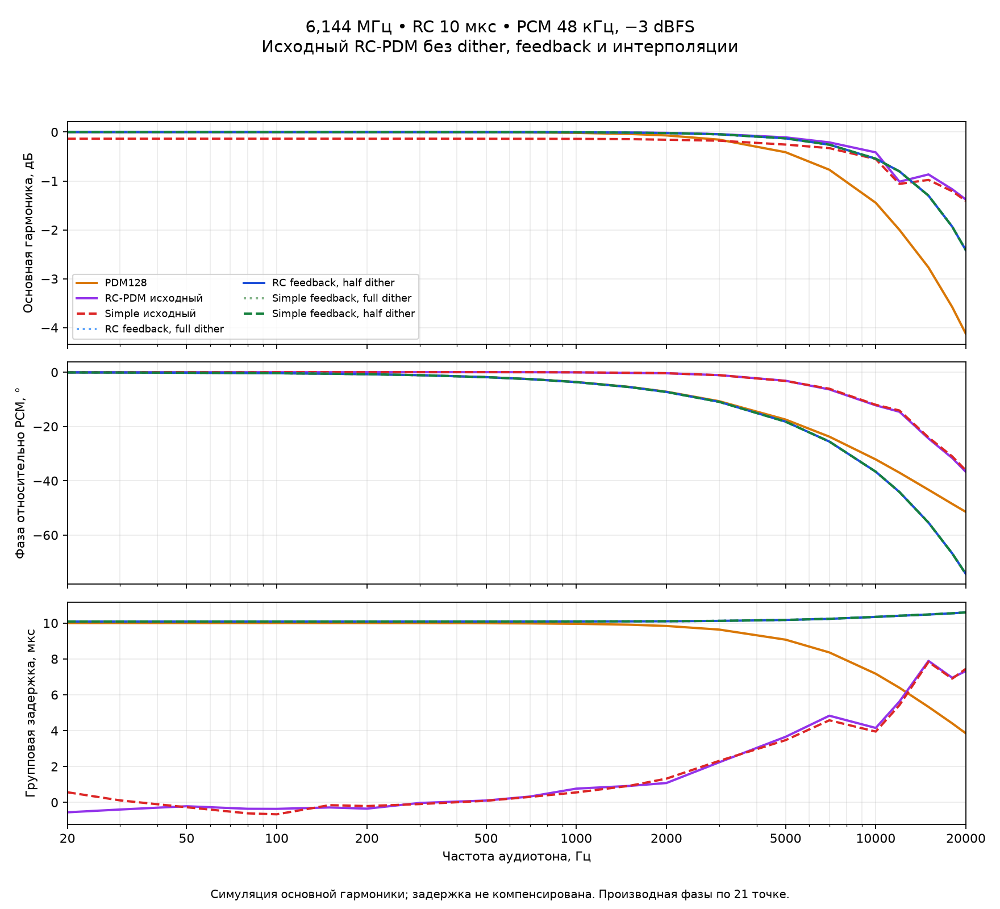

# Исходный RC-PDM против доработанных вариантов на 6,144 МГц

2026-09-06. **Симуляция на ПК, не измерение аналогового выхода или CPU платы.**
Продолжение [сравнения качества](../esp8266-rcpdm-6144-2026-09-06/README.md) и
[измерения АЧХ/ФЧХ](../esp8266-rcpdm-6144-response-2026-09-06/README.md).
Добавлены исходный предиктивный RC-PDM и исходный Simple без доработок.

**Вывод:** при этой частоте исходный RC-PDM нельзя считать равноценной
заменой доработанному: он сильно искажает высокие частоты и теряет тихие
сигналы. У него меньше состояние (4 вместо 16 байт) и меньше фазовая
задержка, но это не компенсирует обнаруженные потери качества.

## Что означает «исходный»

Это алгоритм из `esp8266/rtos-sdk-native/main/rc_pdm.h`, а не новый модулятор
с двумя выключенными флагами. У старого варианта:

- Нет дизеринга и интегратора ошибки `desired − rc` (error feedback).
- **Нет интерполяции**: один целевой уровень PCM удерживается на все 128 бит.
- Состояние — одно беззнаковое 32-битное напряжение, всего **4 байта**.
  Верхняя шина `UINT32_MAX`, цель `(pcm + 32768) << 16`.
- Предиктивное правило выбирает ближайшее следующее RC-напряжение; при
  равенстве выбирается ноль. Исходный Simple сравнивает цель с текущим
  напряжением до обновления. RC-рекурсия сохраняется: «без feedback» здесь
  означает отсутствие дополнительного интегратора ошибки, не отсутствие состояния RC.

Для сопоставимой частоты изменены только параметры настольного адаптера:
**128 новых битов на PCM-отсчёт**, `shift=6`, α=1/64. Это четыре
последовательных слова с непрерывным состоянием, не повторение одного слова.
Штатные константы старой функции 32 бита / shift=4 в прошивке не менялись.
Оставлять shift=4 при 6,144 МГц было бы сравнением другой RC-постоянной времени.

| Вариант | Интерполяция | Интегратор ошибки | Dither | Состояние |
| --- | --- | --- | --- | ---: |
| Обычный PDM128 | Нет | Обычный остаток квантования PDM | Нет | 4 Б |
| Исходный RC-PDM | Нет | Нет | Нет | 4 Б |
| Исходный Simple | Нет | Нет | Нет | 4 Б |
| RC feedback full / half | Линейная | Есть | Полный / половинный | 16 Б |
| Simple feedback full / half | Линейная | Есть | Полный / половинный | 16 Б |

У новых RC-вариантов другая шкала fixed-point и округление: полная шкала
2^29 вместо UINT32_MAX. Следовательно, это сравнение **полных алгоритмов**,
а не изолированная оценка влияния только дизеринга или только feedback.

## Одинаковые условия

Во всех семи путях PCM 48 кГц / 16 бит / моно, выход **6,144 МГц**.
RC-модель α=1/64 соответствует дискретной постоянной около 10,335 мкс.
Физические модели одинаковы: RC 10 мкс, RC 40 мкс, пассивная двухзвенная
лестница 1 кОм / 10 нФ. Таблицы и график ниже относятся к **RC 10 мкс**.

Проверяются 21 синус −3 dBFS от 20 Гц до 20 кГц, 1-кГц синусы
−20/−40/−60/−80 dBFS, цифровой ноль, пять прежних радиозаписей по ~12 с,
отдельно постоянные ±1 LSB и 1-кГц проба ±1 LSB.

Методика качества и фазы та же, что в предыдущем отчёте: секундные Hann-окна,
после 0,25 с установления. Полоса качества **20…20001 Гц** включает верхний
защитный бин для полного лепестка тона 20 кГц. Фаза основной гармоники
измеряется по трём бинам относительно удерживаемого PCM. Из радиосигналов
усиление или задержка не подгоняются. Старые результаты в полосе 20…20000 Гц
перепроверяются отдельно; они не заменяются числами новой полосы.

## SINAD на громких тонах, дБ — выше лучше

| Алгоритм | 1 кГц −3 dBFS | 10 кГц −3 dBFS | 20 кГц −3 dBFS |
| --- | ---: | ---: | ---: |
| Обычный PDM128 | 57,02 | 52,30 | 46,47 |
| **Исходный RC-PDM** | **54,87** | **25,15** | **16,21** |
| Исходный Simple | 57,87 | 25,35 | 16,34 |
| RC feedback, full | 83,56 | 74,62 | 49,23 |
| RC feedback, half | 87,09 | 75,12 | 49,30 |
| Simple feedback, full | 83,67 | 74,61 | 49,33 |
| Simple feedback, half | 87,34 | 75,13 | 49,41 |

Исходные варианты особенно сильно проигрывают на высоких частотах. Увеличение
выходной частоты само по себе не устраняет их искажения. Даже обычный PDM128
на 10/20 кГц в этом тесте значительно лучше старого RC-PDM. На 20 кГц высшие
гармоники лежат за полосой и `thd_db=null`, но шум и паразитные внутриполосные
составляющие, включая алиасы, учитываются в SINAD. Null не означает нулевые
искажения. Отдельный когерентный PDM-тон 12 кГц имеет неопределённый SINAD
из-за округления остаточной мощности до нуля; это также не «идеальный звук».

## Тихие сигналы и цифровой ноль

SINAD на синусе 1 кГц, та же полоса и RC. «Нет тона» означает, что основная
гармоника не обнаружена, а не что SINAD бесконечен.

| Уровень | PDM | Исходный RC | Исходный Simple | RC full | RC half | Simple full | Simple half |
| --- | ---: | ---: | ---: | ---: | ---: | ---: | ---: |
| −20 dBFS | 40,95 | 41,03 | 42,72 | 73,09 | 75,31 | 73,15 | 75,26 |
| −40 dBFS | 18,35 | 5,34 | 6,00 | 53,21 | 55,08 | 53,22 | 55,02 |
| −60 dBFS | −7,96 | Нет тона | Нет тона | 33,15 | 34,72 | 33,14 | 34,74 |
| −80 dBFS | Нет тона | Нет тона | Нет тона | 12,93 | 14,82 | 13,00 | 14,70 |

Для обоих старых RC на −60/−80 dBFS проверены не только FFT, но и слова:
после установления идёт такое же постоянное чередование битов, как на
цифровом нуле. В отдельной пробе 1 кГц ±1 LSB коэффициент передачи у
обоих **0**, постоянные +1 и −1 LSB также не проходят. В новом RC half
коэффициент этой пробы около 0,99968, в Simple half — 0,99970.

Обычный PDM не идеален: в этой конкретной пробе ±1 LSB его коэффициент
4,8358, хотя постоянные ±1 LSB передаются правильно. Это нелинейность
детерминированного PDM без dither, не усилитель с постоянным коэффициентом ×4,8.

На цифровом нуле обычный PDM и старые RC имеют шум полосы ниже численного
порога модели. У новых RC full/half он около −96,81/−99,33 dBFS,
у Simple full/half −96,74/−99,35 dBFS. Отсутствие шума у старых вариантов
сопровождается потерей малых сигналов; это не преимущество по точности.
Аналоговые помехи питания, GPIO и компонентов в эти оценки не входят.

LSB для старых RC/PDM измерены по восьми секундным окнам, один запуск:
у них нет PRNG. Сводки новых вариантов взяты из прежнего проверенного
трёх-seed исследования; это явно отмечено в JSON, а не выдано за новый запуск.

## АЧХ и ФЧХ



| Алгоритм | Усиление на 20 кГц | Фаза на 1 кГц | Фаза на 10 кГц | Фаза на 20 кГц |
| --- | ---: | ---: | ---: | ---: |
| Обычный PDM128 | −4,127 дБ | −3,595° | −32,142° | −51,488° |
| Исходный RC-PDM | −1,381 дБ | −0,049° | −12,197° | −36,755° |
| Исходный Simple | −1,408 дБ | −0,033° | −11,998° | −36,184° |
| RC feedback, half | −2,418 дБ | −3,631° | −36,659° | −74,371° |
| Simple feedback, half | −2,419 дБ | −3,632° | −36,668° | −74,391° |

У исходных RC-вариантов меньшая фаза и меньшее ослабление на 20 кГц, однако
**существенно худший SINAD**. Амплитуда/фаза основной гармоники не показывают
всю энергию искажений и сами по себе не означают лучшее воспроизведение.
Новый алгоритм дополнительно интерполирует PCM, чего старый не делает.

На графике показана полная фаза, без вычитания задержки. Компенсированная
характеристика сохранена отдельно в JSON: для новых RC вычитается только
известная задержка интерполяции 10,335286 мкс, для старых RC и PDM — ноль.
Групповая задержка — численная производная фазы по 21 точке. У нелинейного
модулятора это описание основной гармоники при данном уровне, а не общая
передаточная функция линейной системы и не задержка сети/декодера/DMA.

У старого RC график производной неровный, местами даёт около −0,6 мкс
на низких частотах. Это локальная оценка фазы нелинейного квантователя по
разреженным точкам, не физическая отрицательная задержка и не предсказание будущего.

## Пять радиофрагментов: ошибка формы сигнала

Здесь **не SINAD**, а SNR относительно исходной формы PCM: он включает
ослабление, фазу, интерполяцию, шум и искажения. Везде историческая полоса
20…20000 Гц для точного сопоставления с прежними данными.

В последних двух столбцах указано «без коррекции / после вычитания только
известной задержки интерполяции». Второе число взято из прежнего отчёта
для тех же заново проверенных PCM и битов; задержка не подбирается по максимуму.
У старых вариантов интерполяции нет, такая поправка равна нулю.

| Фрагмент | PDM | Исходный RC | Исходный Simple | RC half, raw / compensated | Simple half, raw / compensated |
| --- | ---: | ---: | ---: | ---: | ---: |
| Маяк | 16,60 | 30,82 | 29,08 | 15,82 / 37,30 | 15,82 / 37,31 |
| Record | 17,78 | 32,84 | 30,70 | 16,59 / 35,20 | 16,58 / 35,20 |
| Ретро | 17,35 | 39,61 | 34,40 | 16,35 / 36,16 | 16,34 / 36,17 |
| Symphony | 26,20 | 20,84 | 20,44 | 29,46 / 56,34 | 29,46 / 56,36 |
| Вести | 18,92 | 28,11 | 26,95 | 18,31 / 40,93 | 18,30 / 40,93 |

Это не универсальная победа нового алгоритма по любой метрике: например,
на данном фрагменте «Ретро» исходный RC ближе к удерживаемой форме PCM
даже после указанной поправки нового. Но на тихих сигналах и громких
высокочастотных тонах старый RC явно хуже. Таблицы нельзя смешивать:
ошибка формы с задержкой — не только энергия шума и нелинейных искажений.

## Проверки

- 21 частота × 7 алгоритмов × 3 физических фильтра; всего 31 основной вход.
- Исходный matrix self-test: 3 249 553 сравнения слов/состояний и 3840
  проверок разбиения на группы. Новый фильтр `--matched-6144` оставляет
  только PDM128, RC128/α64 и Simple128/α64; прежние 23 варианта не меняются.
- Modern self-test: 2 826 240 сравнений; те же пять доработанных путей.
- Во время основных legacy-захватов дополнительно 79 483 212 сравнений
  слов/состояний с независимой 64-битной моделью. Отдельные LSB-захваты
  тоже сверяются на каждом слове.
- Заново совпали все 21 прежняя частотная характеристика для пяти путей,
  12 современных контрольных входов и 9 legacy-входов: PCM, хеши битов,
  метрики в старой полосе (допуск 1e-8), комплексные отклики новых вариантов.
- [native-tests.log](native-tests.log), [model-tests.log](model-tests.log),
  [run.log](run.log): **18 native/архивных и 23 численных теста — PASS**.

Скорость и загрузка CPU не измерялись. Время этой тестовой программы
включает независимые модели и FFT и не характеризует стоимость алгоритма
на ESP8266. Переход штатной прошивки на новый вариант требует отдельного
профилирования и проверки физического аналогового выхода.

## Воспроизведение

Нужны Node, C++17-компилятор, Python с NumPy и Matplotlib. Для полного теста
нужны прежние пять PCM-радиозаписей с SHA-256 из контрольного отчёта.
`--skip-radio` запускает воспроизводимые синтетические входы без этих файлов.

```powershell
python tools/esp8266_audio_profile/measure_rcpdm_6144_legacy.py --output radio_output/rcpdm-legacy-new --archive radio_output/rcpdm-legacy-new/report
node --test tests/esp8266-rcpdm-6144-legacy.test.js tests/esp8266-pdm-matrix.test.js
python -m unittest discover -s tests -p '*pdm*quality_model_test.py' -v
```

Основные результаты: [results.json](results.json). Исходные PCM и битовые
потоки не добавляются в Git; их хеши, параметры и доказательства сверки
сохраняются. Прошивка, профиль по умолчанию и плата **не изменялись**.
