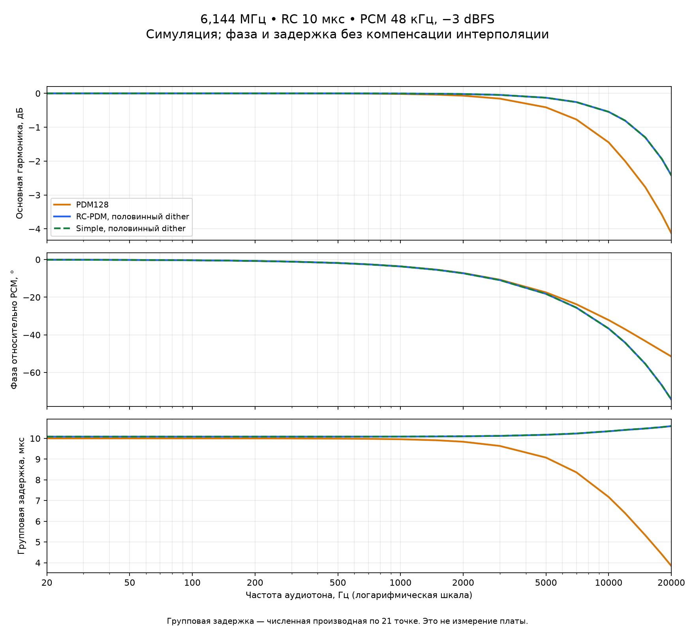

# 6,144 МГц: тоны 10/20 кГц, АЧХ, ФЧХ и групповая задержка

2026-09-06. **Настольная симуляция, не измерение аналогового выхода платы.**
Продолжение [сравнения PDM / Predictive / Simple](../esp8266-rcpdm-6144-2026-09-06/README.md).
Алгоритмы не изменялись. Плата не прошивалась; скорость ESP8266 не измерялась.

## Результат

Predictive и Simple с feedback, интерполяцией и половинным dither практически
совпадают по амплитуде и фазе. На 10 кГц их SINAD около 75 дБ, на 20 кГц —
49 дБ. У нашего обычного PDM128 — соответственно 52 и 46 дБ. Преимущество
RC-вариантов на 20 кГц намного меньше, чем на 1 кГц; результат 87 дБ на
1 кГц нельзя переносить на весь диапазон.

У RC-вариантов задержка ближе к постоянной по частоте: примерно 10,08–10,59 мкс
против 10,00–3,85 мкс у PDM с тем же RC-фильтром. Больший фазовый сдвиг на
верхних частотах сам по себе не означает больше фазовых искажений: постоянная
задержка даёт линейную фазу. Это характеристика основной гармоники при заданном
уровне, а не доказательство линейности модулятора при любых сигналах.

## Условия и граница 20 кГц

- Во всех пяти вариантах **6,144 МГц**, 128 новых битов на отсчёт PCM.
- Моно PCM 48 кГц / 16 бит, синусы −3 dBFS, длительность каждого 3 с.
- Частоты: 20, 30, 50, 80, 100, 150, 200, 300, 500, 700, 1000, 1500,
  2000, 3000, 5000, 7000, **10000**, 12000, 15000, 18000, **20000 Гц**.
- RC-варианты: α=1/64 (`shift=6`), feedback включён, линейная интерполяция,
  общий seed 2654435769. Full: TPDF ±полшага RC; half: ±четверть шага.
- Модели физических фильтров одинаковы для всех: RC 10 мкс, RC 40 мкс,
  пассивная двухзвенная лестница R1=R2=1 кОм, C1=C2=10 нФ без буфера.
  В таблицах и на рисунке ниже — **RC 10 мкс**; остальные есть в JSON.
- Два окна Hann по 1 с, после 0,25 с установления. Последние 0,75 с не
  входят в целые окна. Напряжение битов ±1; учтён ZOH битового интервала.

Формальная звуковая полоса — 20 Гц–20 кГц. Но для всех новых строк интеграция
качества выполнена по FFT-бинам **20…20001 Гц**, с единственным верхним
защитным бином. Это нужно, чтобы не отрезать верхний лепесток Hann у тона
20 кГц и второй гармоники тона 10 кГц. Без него теряется 1/6 энергии
такой основной гармоники (около 0,792 дБ). Нижняя граница качества осталась
20 Гц; у граничного тона 20 Гц нижний бин 19 Гц в SINAD не включён.

Метрика фазы/усиления независимо использует **все три бина основной
гармоники**, включая 19 Гц при тоне 20 Гц. Прежний отчёт не переписан:
его полоса остаётся 20…20000 Гц. Контрольные метрики 1/7 кГц в старой полосе
заново совпали, но новые SINAD слегка отличаются из-за добавленного бина
(он может содержать и шум/гармонику, а не только край исследуемого тона).

## SINAD, дБ — выше лучше

| Тон −3 dBFS | PDM128 | Predictive full | Predictive half | Simple full | Simple half |
| --- | ---: | ---: | ---: | ---: | ---: |
| 1 кГц, контроль | 57,02 | 83,56 | 87,09 | 83,67 | 87,34 |
| 7 кГц, контроль | 57,10 | 82,10 | 86,36 | 82,19 | 86,61 |
| **10 кГц** | **52,30** | **74,62** | **75,12** | **74,61** | **75,13** |
| **20 кГц** | **46,47** | **49,23** | **49,30** | **49,33** | **49,41** |

На 20 кГц высшие целочисленные гармоники уже вне звуковой полосы, поэтому
`thd_db=null`, **не «искажения равны нулю»**. SINAD по-прежнему учитывает
внутриполосные шумы и паразитные составляющие, включая алиасы. На этих
частотах сравнивается весь путь от конечного 16-битного PCM, а не идеальный
бесконечно точный синус. Один SINAD не отражает ослабление основной гармоники.

Особый случай JSON: на когерентном тоне 12 кГц (ровно Fs/4) обычный PDM
имеет `tone_detected=true`, но `sinad_db=null`: вычитание энергии основной
гармоники из общей энергии полосы округляется до нуля. Это предел численного
измерения остатка, не пропавший тон и не обещание бесконечного SINAD на плате.

## АЧХ и ФЧХ



На рисунке полная фаза относительно удерживаемого входного PCM: **задержка
интерполяции не вычтена**. Основная гармоника отсчитывается от того же PCM,
развёрнутого на сетку 6,144 МГц, с той же апертурой удержания. Это не фаза
относительно идеального аналогового синуса до дискретизации, не задержка
сетевого потока/декодера/DMA и не задержка от кнопки Play до звука.

| Частота | PDM: усиление / фаза | Predictive half: усиление / фаза | Simple half: усиление / фаза |
| --- | ---: | ---: | ---: |
| 20 Гц | 0,00 дБ / −0,072° | 0,00 дБ / −0,073° | 0,00 дБ / −0,073° |
| 1 кГц | −0,017 дБ / −3,595° | −0,005 дБ / −3,631° | −0,005 дБ / −3,632° |
| 7 кГц | −0,771 дБ / −23,741° | −0,258 дБ / −25,554° | −0,258 дБ / −25,560° |
| 10 кГц | −1,446 дБ / −32,142° | −0,545 дБ / −36,659° | −0,545 дБ / −36,668° |
| 20 кГц | −4,127 дБ / −51,488° | −2,418 дБ / −74,371° | −2,419 дБ / −74,391° |

Максимальное различие Predictive half / Simple half среди 21 точки:
**0,0196° по фазе и 0,000386 дБ по усилению**. Это номинальный результат
одного общего seed, не статистическое доказательство превосходства одного
метода: отклонение фазы отдельного окна от среднего доходило до 0,034°.

Для выделения влияния интерполяции отдельно сохранена компенсированная фаза:

```text
H(f) = sum(Y(f) × conj(X(f))) / sum(|X(f)|²)
phase = unwrap(arg(H))
known_delay = 127 / (2 × 6144000) = 10,335286 мкс  [RC-варианты]
phase_compensated = phase + 2πf × known_delay
group_delay = −d(phase) / d(2πf)
```

Суммирование H идёт по трём бинам и обоим окнам; Y уже включает физический
RC-фильтр. Для PDM `known_delay=0`. Никакой подгонки задержки по результату
или индивидуальной калибровки усиления нет. У Predictive half остаточная
фаза после этого вычитания около +0,548° на 10 кГц и +0,043° на 20 кГц;
у Simple half — +0,539° и +0,023°. Малый отрицательный остаток групповой
задержки в части полосы после компенсации **не означает некаузальный выход**:
он является остатком после вычитания известной задержки из полного тракта.

Групповая задержка оценивается численной производной по неравномерной сетке
21 частоты (трёхточечная формула, односторонняя на концах). Это приближение;
для точного анализа узких особенностей нужна более плотная сетка. ФЧХ
модулятора с feedback/dither характеризует основную гармонику именно при
−3 dBFS; её нельзя без проверки считать передаточной функцией линейной системы.

## Проверки и воспроизведение

- [results.json](results.json): 21 тон × 5 вариантов × 3 фильтра, комплексные
  передаточные коэффициенты обоих окон, АЧХ/ФЧХ/задержка, качество, SHA-256
  PCM/битов/исходников, версии библиотек.
- Повторный полный sweep: все 105 хешей битовых потоков, численные метрики и
  комплексные отклики в точности совпали; все PCM в повторе созданы заново.
- 2 826 240 сравнений слов/состояния с независимыми 64-битными моделями.
- Контроли 1/7 кГц: те же PCM и все пять битовых потоков, метрики старой
  полосы сверены с прежним отчётом с допуском 1e-8.
- Тесты фазы проверяют известную задержку 17 бит и аналитический RC,
  знак/развёртку фазы, компенсацию постоянных 80 мкс, границу Hann 20 кГц.
- [native-tests.log](native-tests.log), [model-tests.log](model-tests.log),
  [run.log](run.log). Итог: **15 native/архивных и 21 численный тест — PASS**.

Все входы этого нового sweep синтетические и автоматически генерируются.
Локальные радиозаписи не нужны; SHA-256 тонов 1/7 кГц обязан совпасть с
контролями в Git. Нужны C++17-компилятор (в Windows MSVC), Node и Python
с NumPy/Matplotlib (здесь 2.3.5/3.11.1).

```powershell
python tools/esp8266_audio_profile/measure_rcpdm_6144_response.py --output radio_output/rcpdm-response-new --archive radio_output/rcpdm-response-new/report
node --test tests/esp8266-rcpdm-6144-response.test.js tests/esp8266-rcpdm-6144.test.js
python -m unittest discover -s tests -p '*pdm*quality_model_test.py' -v
```

**Практический вывод:** Simple с feedback сохраняет практически ту же
частотную/фазовую картину, что Predictive. На 6,144 МГц оба требуют отдельной
проверки CPU, непрерывности DMA и реального аналогового выхода перед
переключением штатной прошивки. Эта работа таких аппаратных проверок не заменяет.
